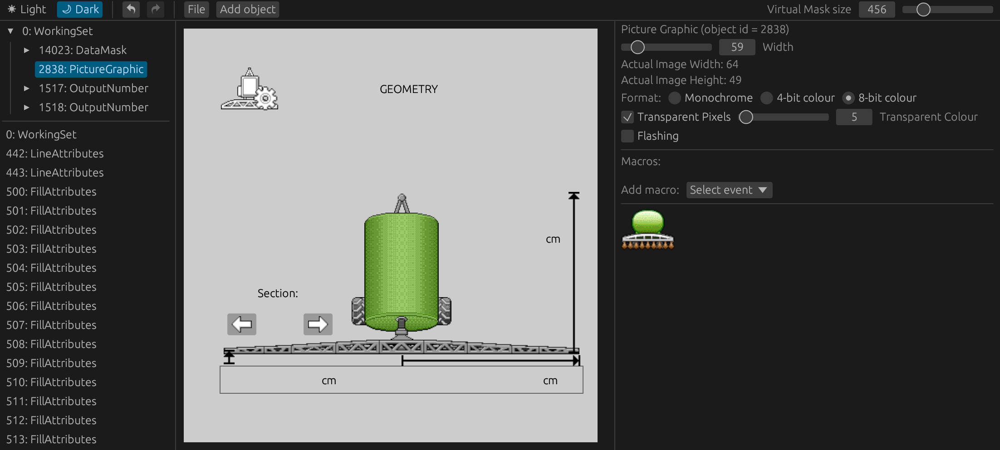

<div align="center">

# AgIsoTerminalDesigner 🚜

— <ins>**Ag**</ins>riculture <ins>**ISO**</ins>-11783 Virtual <ins>**Terminal Designer**</ins>

The experimental graphical editor for designing a Virtual Terminal (VT) for everyone - from hobbyists to industry!

[Web Application](https://open-agriculture.github.io/AgIsoTerminalDesigner/) |
[Issues & Suggestions](https://github.com/Open-Agriculture/AgIsoTerminalDesigner/issues) | [Discord](https://discord.gg/uU2XMVUD4b) | [Telegram](https://t.me/+kzd4-9Je5bo1ZDg6)

[](#)
[](LICENSE)
[](https://github.com/sponsors/GwnDaan)



</div>

> AgIsoTerminalDesigner simplifies creating and editing object pools for ISOBUS terminals by providing a graphical interface, enabling anyone to design their own virtual terminal interfaces.

- [Current Status](#current-status)
    - [Features](#features)
    - [What's Next](#whats-next)
    - [Supported Objects](#supported-objects)
- [Installation](#installation)
    - [Prerequisites](#prerequisites)
    - [Running standalone](#running-standalone)
    - [Running the Web Application](#running-the-web-application)
- [Contributing](#contributing)
- [Disclaimers](#disclaimers)

## Current Status

This project is under **active development**. While some features may not yet be fully supported or fully compliant with AEF standards, improvements are ongoing.

### Features

- [Web version](https://open-agriculture.github.io/AgIsoTerminalDesigner/) for easy access
- Load and save object pools from/to files
- Navigate through the object pool tree
- Use hyperlinks to navigate to referenced objects
- Render active mask and current selection in a preview window
- Limit selecting macro's and object references to allowed types only.

### What's Next

The list below outlines some of the features and improvements that are planned to be implemented in the future. The order is a good indication of the priority.

- Add the remaining objects for configuration and rendering.
- Display a preview of the active soft key mask.
- Allow changing VT version and adjust object pool configuration/rendering accordingly.
- Implement the ability to give objects custom names.
- Add a colour picker for colour attributes.
- Add a search bar to quickly find objects.
- Show a pop-up when creating a new object for initial configuration.

If you have any suggestions or would like to contribute, feel free to open an issue or submit a pull request!

### Supported Objects

The lists below only apply to version 3 of the VT specification. There are 3 stages of development for each object: **Not Started** [ :white_circle: ], **In Progress** [ :yellow_circle: ], and **Completed** [ :green_circle: ]. Open an issue if you would like to prioritize a specific object, or even better, submit a pull request to help implement it!

#### Configurable Types

- :yellow_circle: WorkingSet (missing language codes)
- :green_circle: DataMask
- :green_circle: AlarmMask
- :green_circle: Container
- :green_circle: SoftKeyMask
- :green_circle: Key
- :yellow_circle: Button (missing options, keycode, border colour)
- :green_circle: InputBoolean
- :green_circle: InputString
- :green_circle: InputNumber
- :green_circle: InputList
- :green_circle: OutputString
- :green_circle: OutputNumber
- :yellow_circle: OutputList
- :yellow_circle: OutputLine
- :yellow_circle: OutputRectangle
- :yellow_circle: OutputEllipse
- :yellow_circle: OutputPolygon
- :yellow_circle: OutputMeter
- :yellow_circle: OutputLinearBarGraph
- :yellow_circle: OutputArchedBarGraph
- :yellow_circle: PictureGraphic (missing loading images from file)
- :yellow_circle: NumberVariable
- :yellow_circle: StringVariable
- :yellow_circle: FontAttributes
- :yellow_circle: LineAttributes
- :yellow_circle: FillAttributes
- :yellow_circle: InputAttributes
- :green_circle: ObjectPointer
- :yellow_circle: Macro
- :yellow_circle: Auxiliary Function Type 2
- :yellow_circle: Auxiliary Input Type 2
- :yellow_circle: Auxiliary Control Designator Type 2 Object Pointer

#### Renderable Types

- :green_circle: WorkingSet
- :yellow_circle: DataMask (missing soft key mask)
- :yellow_circle: AlarmMask (missing soft key mask)
- :green_circle: Container
- :white_circle: SoftKeyMask
- :yellow_circle: Key
- :green_circle: Button
- :yellow_circle: InputBoolean
- :white_circle: InputString
- :yellow_circle: InputNumber
- :white_circle: InputList
- :yellow_circle: OutputString
- :yellow_circle: OutputNumber
- :white_circle: OutputList
- :yellow_circle: OutputLine
- :yellow_circle: OutputRectangle
- :white_circle: OutputEllipse
- :white_circle: OutputPolygon
- :white_circle: OutputMeter
- :white_circle: OutputLinearBarGraph
- :white_circle: OutputArchedBarGraph
- :green_circle: PictureGraphic
- :green_circle: ObjectPointer
- :white_circle: Auxiliary Function Type 2
- :white_circle: Auxiliary Input Type 2
- :white_circle: Auxiliary Control Designator Type 2 Object Pointer


## Installation

### Prerequisites

- Rust toolchain (stable)
- (optional) `libgtk-3-dev` for building the native version on Linux
- (optional) [Trunk](https://trunkrs.dev/) for building the web version

### Running standalone

```bash
cargo run --release
```

### Running the Web Application

```bash
trunk serve --release
```

Then open your browser at `http://localhost:8080`.

## Contributing

This project is still a work in progress, and contributions are appreciated! Feel free to open issues or submit pull requests to help improve the project.

## Disclaimers

Because this software is licensed under the GPL v3.0, you may not include this software in any closed source software, nor link to it in any way from closed source software.

This project is not associated with the Agricultural Industry Electronics Foundation (AEF) in any way.

This project is not associated with the International Organization for Standardization (ISO) in any way.

Don't ask us to share the ISO standards with you. We can't. You have to buy them from ISO. We don't have the right to share them with you.

This software was not created to compete with any commercial or open-source software. It was created to help hobbyists and professionals alike learn about and experiment with ISOBUS.